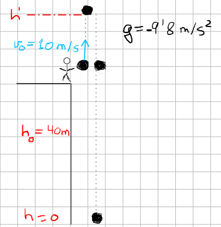
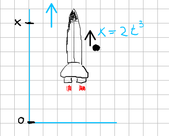

- ## Problema 13
  type:: problem
  unit:: 0
	- Una persona se encuentra en el borde de una azotea de un edificio a $40m$ de altura. Lanza hacia arriba una pelota con una velocidad inicial de $10m/s$. Calcular:
		- a) La altura máxima que alcanza la pelota
		- b) Tiempo que tarda la pelota en llegar a la altura desde la que fue lanzada.
		- c) Tiempo que tarda en llegar al suelo.
	- ## Solución
	- Se trata de un movimiento vertical (MRAU)
	- La aceleracíon será la gravedad $g=9,8m/s^2$.
		- {:height 295, :width 263}
		-
- Las ecuaciones del movimiento mientras la pelota sube serán.
	-
- $$ v_{h^{\prime}}=v_0-g t \tag{1}$$
- $$h^{\prime}=h_0+v_0 t-\frac{1}{2} g t^2 \tag{2}$$
- Al llegar a la altura máxima $v_h'=0$ sustituimos en $(1)$ y obtenemos el tiempo en llegar a la cota máxima:
	- $$
	  0=v_0-g t \Rightarrow t=\frac{v_0}{g}=\frac{10 \mathrm{~m} / \mathrm{s}}{9.8 \mathrm{~m} / \mathrm{s}^2}=1.02 \mathrm{~s}
	  $$
	-
- Sustituimos es tiempo en $(2)$ y obtenemos la altura de la cota máxima:
	- $$h'=40+10t-\frac{1}{2}9.8t^2 \implies h'=40+10·1.02-\frac{1}{2}9.8(1.02)^2$$
	- $$\boxed {h'=45'1m}$$
	-
- Veamos ahora lo que tarda la pelota en volver a la posicion $h=40m$ desde la cota máxima:
	- $$x=x_0+v_0t-\frac{1}{2}gt^2$$
	- $$40=45.1+0t-\frac{1}{2}9.8t^2$$
	- $$\frac{2·5.1}{9.8}=t^2$$
	- $$t=1.02s$$
	- Por lo tanto el tiempo total:
	- $$\boxed{t_{TOTAL}=1.02+1.02=2.04s}$$
	-
	-
- ## Problema 14
  type:: problem
  unit:: 0
	- Un cohete asciende verticalmente de manera que su altura viene dada por la expresión $x=2t^3$ en el SI. A los $5s$ de iniciarse el movimiento el cohete deja caer una pelota ¿cuanto tiempo tarda la pelota en llegar al suelo?
	- ## Solución
		- 
		-
			- Desplazamiento $x(t)=2 t^3$
			- Velocidad $\quad v(t)=\frac{d x(t)}{d t}=6 t^2$
			- Aceleracion $a(t)=\frac{d v(t)}{d t}=12 t$
		- A los 5 segundos:
		  $$
		  x(5)=2 t^3=2 \cdot(5)^3=250 \mathrm{~m} \quad ; v(5)=6 t^2=6 \cdot(5)^2=150 \mathrm{~m/s}
		  $$
		-
		- Sustituyendo en la ecuacion del movimiento
		- \begin{aligned}
		  x & =x_0+v_0 t-\frac{1}{2} g t^2 \\
		  0 & =250+150 t-\frac{1}{2}(9.8) t^2 \\
		  t & =\frac{-150 \pm \sqrt{(150)^2+4 \cdot \frac{1}{2}(9.8) \cdot 250}}{-2\left(\frac{1}{2} 9.8\right)}=\frac{-150 \pm \sqrt{22500+19.6}}{-9.8}= \\
		  & =\frac{-150 \pm 150.06}{-9.8}=\frac{-300.06}{-9.8}=32.25s
		  \end{aligned}
		- $$\boxed {t=32.25s}$$
- ## Problema 14
  type:: problem
  unit:: 0
	- Un chico se desplaza en bicicleta en linea recta a $10m/s$. Su madre, desde una ventana situada a $3m$ por encima, deja caer las llaves para que cuando el chico pase por debajo de la ventana pueda cogerlas sin modificar la velocidad de la bicicleta. Calcular:
		- a) La distancia horizontal entre la bicicleta y la ventana para que las llaves le lleguen al chico justo cuando pasa.
		- b) El tiempo que estan las llaves en el aire.
		- ## Solución
		-