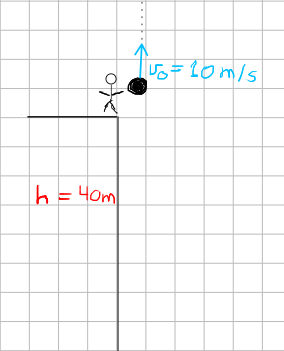

- ## Problema 13
  type:: problem
  unit:: 0
	- Una persona se encuentra en el borde de una azotea de un edificio a $40m$ de altura. Lanza hacia arriba una pelota con una velocidad inicial de $10m/s$. Calcular:
		- a) La altura máxima que alcanza la pelota
		- b) Tiempo que tarda la pelota en llegar a la altura desde la que fue lanzada.
		- c) Tiempo que tarda en llegar al suelo.
	- ## Solución
	- Se trata de un movimiento vertical (MRAU)
	- La aceleracíon será la gravedad $g=9,8m/s^2$.
		- 
- Las ecuaciones del movimiento mientras la pelota sube serán.
	- $$v_y=v_0-gt$$
	- $$h'=h_0+x_0t-\frac {1}{2} gt^2$$
-