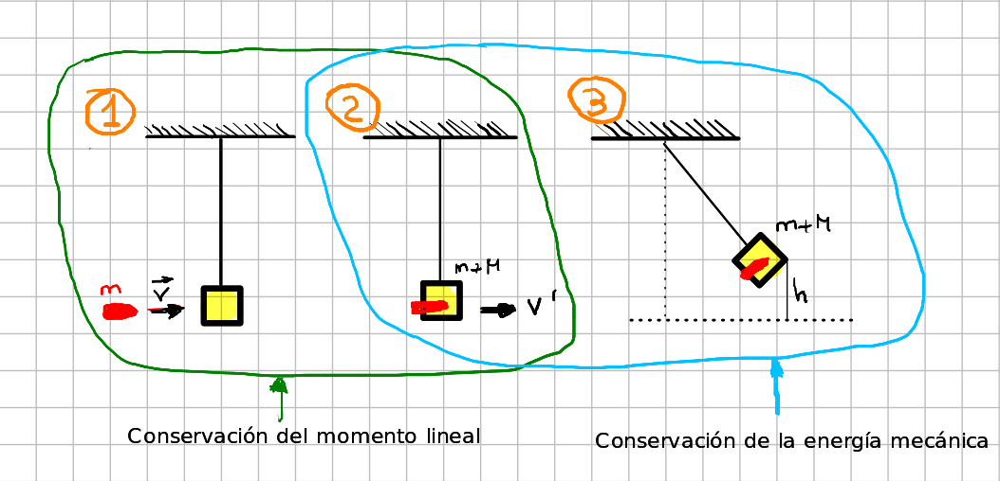

- ## Problema 1
  type:: problem
  tags:: Conservación del Momento Lineal, Conservación de la Energía Mecánica 
  unit:: 2b
	- Un proyectíl de masa $m$ se dispara contra un péndulo balístico de masa $M$. El proyectíl se imcrusta en el bloque y el centro de gravedad del sistema se eleva una altura $h$. Calcular la velocidad de la bala y resolver el problema si $m=20g, M=3kg, h=15cm$.
	- ## Solución
		- 
		- a) Escenario 1 a 2 . Es un ejemplo de choque perfectamente inelástico en el que sabemos que se produce la Conservación del momento lineal.
		- $$
		  \begin{aligned}
		  m v+M V & =(m+M) V^{\prime} \\
		  m v & =(m+M) V^{\prime} \\
		  V^{\prime} & =\frac{m v}{m+M} \tag {1}
		  \end{aligned}
		  $$
		- b) Escenario 2 a 3. En este caso vamos a aplicar el principio de conservación de la energía mecánica.
		- $$
		  \begin{aligned}
		  E_c+E_p & =E_c^{\prime}+E_p^{\prime} \\
		  \frac{1}{2}(m+M) V'^2 & =(m+M) g h \\
		  \frac{1}{2} V'^2 & =g h \\
		  h & =\frac{V'^2}{2 g} \tag {2}
		  \end{aligned}
		  $$
		- Por $(1)$ y $(2)$
		- $$
		  h=\frac{\left(\frac{m v}{m+M}\right)^2}{2 g} \Rightarrow 2 g h=\frac{m^2 v^2}{(m+M)^2} \Rightarrow v^2=2 g h \frac{(m+M)^2}{m^2} \Rightarrow \textcolor {blue} {\boxed {v=\sqrt{2 g h} \frac{m+M}{m}}
		  }$$
		- Particularizamos para los valores indicados en el problema pasados a S.I. de unidades:
		- >$$
		  \begin{aligned}
		  & m=0^{\prime} 02 \mathrm{~kg}, M=3 \mathrm{~kg}, h=0^{\prime} 15 \\
		  & \textcolor{blue} {\boxed {v=258,91 \mathrm{~m} / \mathrm{s}}}
		  \end{aligned}
		  $$
- ## Problema 2
  type:: problem
  tags:: Conservación del Momento Lineal, Conservación de la Energía Mecánica 
  unit:: 2b
	- Un núcleo inestable de masa $1.7·10^{-26}kg$ se encuentra en reposo. En un momento dado se desintegra en tres fragmentos. El primero $m_1=5·10^{-27}kg$ se mueve a lo largo del eje $OY$ a $4·10^6 m/s$. El segundo $m_2=8,4·10^{-27}kg$ se mueve a $3·10^6 m/s$ a lo largo del eje $OX$. Calcula la velocidad del tercer fragmento y la energía liberada en el proceso. (Considerar la pérdida de masa insignificante).
	- ## Solución
	- 
	- Primero vamos a calcular la masa del fragmento 3:
	- $$M=m_1+m_2+m_3$$
	- $$m_3=M-m_1-m_2$$
	- $$m_3=1,7·10^{-26}-5·10^{-27}-8,4·10^{-27}$$
	- $$m_3=3,6·10^{-27}kg$$
	- Ahora sabemos por el principio de conservacion del momento lineal que:
	- $$M\vec V=m_1\vec v_1+m_2\vec v_2+m_3 \vec v_3$$
	- Como al principio el nucleo estaba en reposo:
	- $$0=m_1\vec v_1+m_2\vec v_2+m_3 \vec v_3$$
	- Despejamos $\vec v_3$:
		- $$\vec v_3=\frac {-m_1\vec v_1-m_2\vec v_2}{m_3}$$
	- Sustituimos los datos y obtenemos:
		- $$\vec v_3=\frac{-5·10^{-27}4·10^6\vec j-8,4·10^{-27}3·10^6\vec i}{3,6·10^{-27}}$$
		- $$\textcolor {blue} {\boxed {\vec v_3=-7·10^6\vec i-5,56·10^6 \vec j \enspace m/s}}$$
		- $$|\vec v_3|=\sqrt {(-7·10^6)^2 + (-5,56·10^6)^2}$$
		- $$\textcolor {blue} {\boxed {|\vec v_3|=8,94·10^6 \enspace m/s}}$$
	- Ahora calcularemos la energía liberada, que es la suma de la energia cinética de los tres fragmentos despues de la desintegracion:
	- $$E_c=\frac {1}{2}m_1v_1^2+\frac {1}{2}m_2v_2^2+\frac {1}{2}m_3v_3^2$$
	- $$E_c=\frac {1}{2}5·10^{-27}(4·10^6)^2+\frac {1}{2}8,4·10^{-27}(3·10^6)^2+\frac {1}{2}3,6·10^{-27}(8,94·10^6)^2$$
	- $$\textcolor {blue} {\boxed {E_c=2,22·10^{-13} \enspace j}}$$
	-