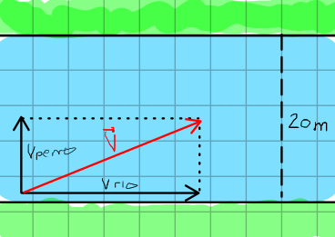

- ## Problema 1
  type:: problem
  unit:: 0
	- El movimiento de una pelota viene dado por el siguiente vector de posición (SI):
		- $$\vec r(t)=4t\vec i+(t^2+2t)\vec j$$
		- Calcular:
		- a.- La posición en el instante t=5 s.
		  b.- El vector desplazamiento entre t=3 s y t=5 s.
		  c.- La ecuación de la trayectoria de la pelota.
		  d.- La velocidad y la aceleración en el instante t=2 s.
	- ## Solución
- ## Problema 2
  type:: problem
  unit:: 0
	- El vector de posición de un cuerpo viene dado por (SI): $\vec r(t)=(t^3-2)\vec i +(2t^2-1)\vec j$
		- Calcula las componentes intrínsecas de la aceleración para $t = 2 s$.
	- ## Solución
	-
- ## Problema 3
  type:: problem
  unit:: 0
	- Las ecuaciones paramétricas para una partícula en movimiento son (SI):
		- $$x=t-2$$
		- $$y=t^2-t+1$$
		- Calcular:
			- a) La posición inicial de la partícula
			- b) La velocidad media en los dos primeros segundos.
			- c) La aceleración instantánea
			- d) La ecuación de la trayectoria.
	- ## Solución
	- ### Apartado a)
	- $$
	  \begin{aligned}
	  & \left.\begin{array}{l}
	  x=t-2 \\
	  y=t^2-t+2
	  \end{array}\right\} \\
	  & \vec{r}(t)=(t-2) i+\left(t^2-t+2\right) j \\
	  & \vec{r}(0)=-2 i+2 j \mathrm{~m} \\
	  & \vec{r}(2)=4 j \mathrm{~m} \\
	  & \boxed{\vec{r}(0)=(-2,2)} \\
	  &
	  \end{aligned}
	  $$
	- ### Apartado b)
		- Ahora veamos la velocidad media en los dos primeros segundos:
		- $$
		  \vec{v}_m=\frac{\Delta \vec{r}}{\Delta t}-\frac{\vec{r}(2)-\vec{r}(0)}{2}=\frac{4 j-(-2 i+2 j)}{2}=\frac{2 i+2)}{2}=i+j \mathrm{~m} / \mathrm{s}
		  $$
		- $$\boxed {\vec{v}_m=i+j \mathrm{~m} / \mathrm{s}}$$
	-
	- ### Apartado c)
		- Para la aceleración instantánea tendremos que derivar dos veces el vector posición:
		- $$
		  \begin{aligned}
		  & \vec{v}(t)=\frac{d \vec{r}(t)}{d(t)}=i+(2 t-1) j \mathrm{~m} / \mathrm{s} \\
		  & \vec{a}(t)=\frac{d \vec{v}(t)}{d t}=2 j \mathrm{~m} / \mathrm{s}^2 \enspace
		  \end{aligned}
		  $$
		- $$\boxed {\vec{a}(t)=2 j \mathrm{~m} / \mathrm{s}^2 \enspace \mathrm{cte}}$$
	- ### Apartado d)
		- La ecuación de la trayectoria la obtendremos despejando el tiempo de las ecuaciones paramétricas:
		- $$
		  \left.\begin{array}{l}
		  x=t - 2 \\
		  y=t^2-t+2
		  \end{array}\right\} \Rightarrow t=x+2
		  $$
		- $$
		  \begin{aligned}
		  & y=(x+2)^2-(x+2)+2 \\
		  & y=x^2+4+4 x-x-2+2 \\
		  & y=x^2+3 x+4
		  \end{aligned}
		  $$
		- La ecuación de la trayectoria es una parábola
		- $$\boxed {y=x^2+3 x+4}$$
- ## Problema 4
  type:: problem
  unit:: 0
	- Un perrito salta a un río y quiere llegar a la orilla contraria. La anchura del río es de $20 m$, la velocidad del perrito es de $0,2 m/s$, perpendicular a la orilla, y la corriente del río tiene una velocidad de $2 m/s$. Calcula:
		- a.- El tiempo que tarda el perrito en cruzar el río.
		  b.- Cuánto se desviará de la perpendicular al río.
		  c.- La distancia total recorrida y el vector velocidad total del perrito.
		  d.- La ecuación de la trayectoria.
	- ## Solución
		- 
		- $$
		  \begin{aligned}
		  & V_{\text {perro }}=0^{\prime} 2 \mathrm{~m} / \mathrm{s}=0^{\prime} 2 \vec j \\
		  & V_{\text {rio }}=2 \mathrm{~m} / \mathrm{s}=2 \vec i \\
		  & y=20 \mathrm{~m}
		  \end{aligned}
		  $$
		- Se trata de un movimiento compuesto. Lo mas importante aquí es entender que cada movimiento funciona de manera independiente.
		- #### Apartado a)
			- $$
			  \begin{aligned}
			  & y=y_0+v_{\text {perro }} t \\
			  & y=2 t \\
			  & 20=0+0.2 t \\
			  & t=\frac{20}{0.2} \\
			  & \boxed {t= 100 \mathrm{~s}}
			  \end{aligned}
			  $$
		- #### Apartado b)
		-
		- $$
		  \begin{aligned}
		  & x=x_0+V_{r, 0} t \\
		  & x=0^{\prime} 2 t \\
		  & x=0+2 \cdot 100 \\
		  & \boxed{x=200 \mathrm{~m}}
		  \end{aligned}
		  $$
		- #### Apartado c)
			- $$
			  d=\sqrt{x^2+y^2}=\sqrt{20^2+200^2}=200.99 \mathrm{~m}
			  $$
			- $$
			  \boxed {\vec{v}=\vec{v}_{\text {perro }}+\vec{v}_{\text {rio}}=2 i+\frac{1}{5} j}
			  $$
		- #### Apartado d)
			- $$
			  \left.\begin{array}{l}
			  y=0.2 t \\
			  x=2 t
			  \end{array}\right\} t=\frac{x}{2}
			  $$
			- $$
			  y=0.2 \frac{x}{2}
			  $$
			- $$\boxed{y=\frac {1}{10}x}$$
- ## Problema 5
  type:: problem
  unit:: 0
	- Una barca quiere cruzar un río de $100 m$ de anchura de manera que llegue al punto que hay justo en frente de donde sale. Sus motores desarrollan una velocidad de $4m/s$, y la velocidad de la corriente rio abajo es de $3 m/s$.
		- ¿Cuál debe ser el ángulo que forme la velocidad con la perpendicular a la orilla? ¿Qué tiempo tarda en cruzar el río?
		- ¿Qué ocurriría si la velocidad de la corriente fuera mayor que la de la barca?
	- Imagina ahora que la velocidad de otra barca es perpendicular a la orilla y que la barca aparece $330 m$ corriente abajo. ¿Cuál era su velocidad?
	- ## Solución
	- 
	- Las ecuaciones del movimiento de la barca son:
	- $$
	  \left.\left.\begin{array}{l}
	  v_{x_{\text {Barca }}}=v_{\text {Barca }} \operatorname{cos} \theta \\
	  v_{y_{\text {Barca }}}=v_{\text {Barca }} \operatorname{sen} \theta
	  \end{array}\right\} \quad \begin{array}{l}
	  x=v_{x_0}+v_{x_{\text {Barca }}} t \\
	  y=v_{y_0}+v_{y_{\text {barca }}} t
	  \end{array}\right\}
	  $$
	-
	- La barca tiene que salir desde la orilla con un ángulo determinado $\theta$ para que su movimiento sea completamente perpendicular a la orilla, osea, la componente $$\vec v_x$$ debe anular a la corriente del rio, lo cual significa que esa componante tiene que tener el mismo módulo y direccion contraria a la velocidad de la corriente del río. Por tanto:
		- $$
		  \left.\begin{array}{l}
		  v_{x_{Barca}}=v_{\text {Barca }} \cos \theta \\
		  v_{x_{\text {Barca}}}=-v_{x_{Rio}}
		  \end{array}\right\}-3=4 \cos \theta \Rightarrow \theta=\operatorname{arcos}\left(-\frac{3}{4}\right)=-48.5^{\circ}
		  $$
	-
		- $$\boxed {\theta = -48.5^{\circ}}$$
		- Veamos el tiempo que tarda en llegar:
			- $$
			  \begin{aligned}
			  y & =v_{\text {Barca}} \cdot \cos \theta t \\
			  100 & =4 \cdot \cos \left(-48.5\right) t \\
			  t & =\frac{100}{4 \cos \left(-48.5\right)}=37.7s
			  \end{aligned}
			  $$
			- $$\boxed{t=37.7s}$$
	- Si la velocidad de la corriente fuera mayor que la de la barca ($v_{Barca} < v_{x_{Rio}}$)
		- Tendríamos
		- $$v_{Barca} \leq v_{x_{Barca}}=v_{Barca} cos\theta$$
		- Ya que $cos \theta \leq 1$ y:
		- $$v_{x_{Barca}} < v_{x_{Rio}}$$
		-
	- Y por lo tanto la barca nunca llegaría al punto justo enfrente al de salida porque seria arrastrada por la corriente en dirección $x$.
	-