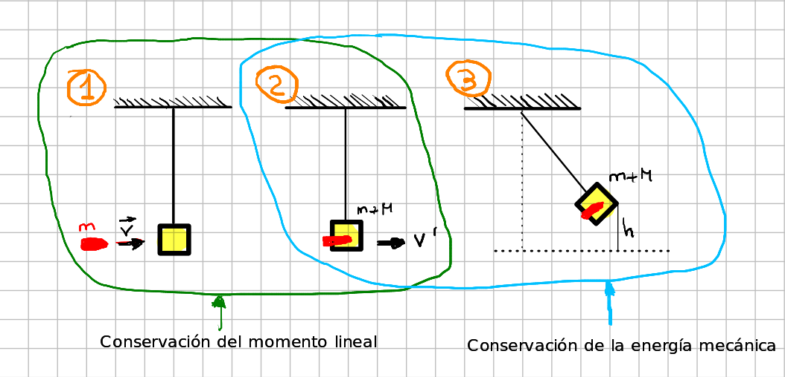

- ## Problema
  type:: problem
  tags:: Conservación del Momento Lineal, Conservación de la Energía Mecánica 
  unit:: 2b
	- Un proyectíl de masa $m$ se dispara contra un péndulo balístico de masa $M$. El proyectíl se imcrusta en el bloque y el centro de gravedad del sistema se eleva una altura $h$. Calcular la velocidad de la bala y resolver el problema si $m=20g, M=3kg, h=15cm$.
	- ## Solución
		- 
		-
-