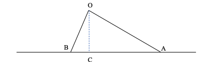

- ## Problema 1
  type:: problem
  unit:: 1
	- Si una misma fuerza actúa $$1 s$$ sobre un cuerpo de $$1 kg$$ y $$4 s$$ sobre un cuerpo
	  de $$4 kg$$.
		- a) imprimirá a ambos la misma aceleración
		  b) el incremento de velocidad será el mismo en ambos casos
		  c) el incremento de la cantidad de movimiento será el mismo en ambos casos
	- Indica la respuesta correcta.
	- ## Solución
		- Usamos la ecuación fundamental:
		- $$F=ma$$
		- Para el caso 1, como $$m_1=1kg$$ y $$t_1=1$$ entonces $$F=a_1$$
			- $$v_f-v_i=a_1t_1= F * 1=F$$
		- En el caso 2, $$m_2=4$$ y $$t_2=4$$ entonces $$F=a_2*4$$
		- $$v_f-v_i=a_2t_2=F/4*4=F$$
		- Así pues la solución correcta es la b)
-
- ## Problema 2
  type:: problem
  unit:: 1
	- Desde un mismo punto O se dejan caer a la vez dos cuerpos por dos planos inclinados OA y
	  OB de diferentes pendientes y sin rozamiento, tal como se muestra en la figura. Siendo $v_A$ y $v_B$
	  las velocidades de los dos cuerpos en los puntos A y B, respectivamente, y $a_A$ y $a_B$ las
	  respectivas aceleraciones, tenemos que:
		- a) $$a_A < a_B$$ y $$v_A=v_B$$
		  b) $$a_A < a_B$$ y $$v_A < v_B$$
		  c) $$a_A > a_B$$ y $$v_A>v_B$$
	- Indica la respuesta correcta.
	- 
	-
	- ## Solución
		- La aceleración en caida viene definida por la segunda ley de Newton:
		- $$a=g sin\alpha$$
		- En el plano inclinado OB la pendiente es mayor y por lo tanto la aceleración también es mayor. Luego descartamos la opción c)
		- La relación entre las aceleraciones es:
		- $$\frac {a_A}{a_B}=\frac {gsen \alpha_A}{gsen \alpha_B}$$
			- Por tanto $$a_A=Ra_B$$, siendo $$R=\frac {sen \alpha_A}{sen \alpha_B}<1$$
		- La relacion entre el espacio recorrido es:
			- $$sen \alpha_A= \frac {OC} {OA}$$ y
			- $$sen \alpha_B = \frac {OC} {OB}$$
			- Por tanto $$OB=R * OA$$
		- Y por último la relación entre los tiempos es:
			- $$OA=\frac {1}{2}a_At_A^2$$
			- $$OB=\frac {1}{2}a_At_B^2$$
			- Que usando lo anterior $$t_B=R*t_A$$
		-
		- Por tanto en OA se recorre más longitud, en más tiempo, con menor aceleración, que en OB.
		- Y en cuanto a la velocidad tenemos que:
			- $$v_A=a_At_A=Ra_B \frac {t_b}{R}=a_Bt_B=v_B$$
		- Por lo tanto la respuesta correcta es la a)
-
- ## Problema 3
  type:: problem
  unit:: 1
	- Un bloque de $10 Kg$ de masa se encuentra en reposo en un plano inclinado $30º$. Si el coeficiente de rozamiento estático y dinámico entre el plano y el cuerpo es $0.7$, ¿cuánto vale la fuerza de rozamiento? ($g=9.8 m/s^2$)
	- ## Solución
		- Como el bloque se encuentra en reposo esto quiere decir que suma de todas las fuerzas que se ejercen sobre el bloque tiene que ser 0 en este caso la fuerza de rozamiento tiene que ser igual y de sentido contrario a la componente tangencial de la fuerza de la gravedad:
			- $$F=mgsen \alpha=10·9,8·sen 30=49N$$
- ## Problema 4
  type:: problem
  unit:: 1
	- Un peso de 80 kg está de pie sobre una balanza de muelle sujeta al suelo de un ascensor. La balanza está calibrada en newtons. Tomamos como positiva la dirección hacia arriba ¿Qué peso indicará la balanza cuando el ascensor se mueve con aceleración $a_1$ positiva?
	- ## Solución
		- Sobre el peso y en dirección vertical se aplica la fuerza normal de la balanza $$F_N$$ hacia arriba y el peso $$P=mg$$ hacia abajo. La ecuación de la fuerza final será:
		- $$F_N-mg=ma_1$$
		- Puesto que $a_1$ es positiva la lectura de la balanza será:
		- $$F_N=m(g+a_1)$$
- ## Problema 5
  type:: problem
  unit:: 1
	- En el problema anterior, ¿qué peso indicará la balanza cuando el ascensor asciende, pero con aceleración $a_2$ negativa?
	- ## Solución
		- Lo mismo que el anterior pero en este caso:
		- $$F_N=m(g-a_1)$$
- ## Problema 6
  type:: problem
  unit:: 1
	- Una persona se encuentra sobre una báscula en un ascensor. ¿En cuál de los casos siguientes será menor la lectura de la báscula?
		- a) el ascensor está en reposo
		  b) el ascensor baja con velocidad constante
		  c) el ascensor baja aumentando su velocidad
	- ## Solución
		- Sobre la persona actúan dos fuerzas: su peso $P$ y la fuerza normal de reacción de la báscula que soporta
		  a la persona, $F_N$. El peso que mide la báscula es igual a $F_N$.
		- $$F_N=P-ma$$
		- a) La lectura de la báscula sera la del peso de la persona ya que no hay aceleracion
		- b) Al no existir aceleración derivada del movimiento tampoco variará la lectura de la báscula.
		- c) El ascensor baja con aceleracion positiva ya que va aumentando la velocidad por lo que la acelaración resultante sera menor que la gravedad (se resta de g ) y la lectura de la báscula será inferior.