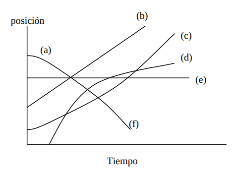
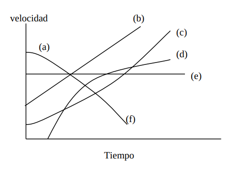
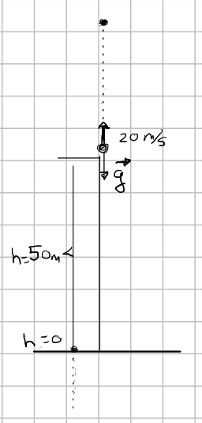
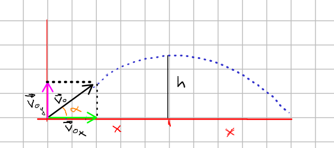
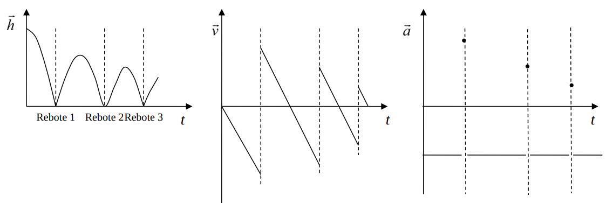

- ## Problema 1
  type:: problem
  unit:: 0
	- ¿Cuál de las curvas en el plano posición-tiempo adjunto describe mejor el movimiento de un
	  cuerpo sometido a una aceleración positiva y constante?
	- 
	- ## Solución
		- La (c)
	-
- ## Problema 2
  type:: problem
  unit:: 0
	- ¿Cuál de las curvas en el plano velocidad-tiempo adjunto describe mejor el movimiento de un
	  cuerpo sometido a una aceleración positiva y constante?
	- {:height 363, :width 480}
	- ## Solución
		- La (b)
- ## Problema 3
- type:: problem
  unit:: 0
	- Una persona pasea con su perro, dirigiéndose ambos en línea recta hasta una cabaña que dista $10 km$ y partiendo del mismo punto. La persona camina a una velocidad constante de $5 Km/h$. El perro, que va más deprisa, se mueve al doble de velocidad que el cazador. Como el perro se mueve más rápido, llega a la cabaña primero. Una vez que ha llegado a la cabaña, regresa en busca de su acompañante hasta que se encuentra con ella. Cuando la encuentra decide dar la vuelta y regresa otra vez a la cabaña, y así sucesivamente se dedica a ir y venir desde la persona hasta la cabaña y desde la cabaña a la persona, hasta que la persona llega a la cabaña. ¿Qué distancia recorre el perro?
	- ## Solución
		- Si la persona ha recorrido $$10km$$ en total el perro habrá recorrido el doble, es decir $$20km$$ ya que su velocidad es el doble y han estado en movimiento el mismo tiempo.
- ## Problema 4
  type:: problem
  unit:: 0
	- Un ascensor de $3 m$ de altura sube con una velocidad constante de $1 m/s$. Cuando se encuentra
	  a una cierta altura se desprende la lámpara del techo. Calcular el tiempo que tarda la lámpara
	  en llegar al suelo del ascensor medido por un observador situado dentro del ascensor y el
	  tiempo que tarda en caer la lámpara medido por un observador en reposo fuera del ascensor.
	  (Tomar $g=9.8 m/s^2$)
	- ## Solución
		- Si no tenemos en cuenta efectos relativistas (son completamente despreciables debido a la velocidad relativa tan pequeña entre ambos sistemas de referencia), el tiempo medido por ambos observadores debe ser el mismo. Veamos que esto es así.
			- #### Desde dentro del ascensor:
				- Se trata de un sistema de referencia que se mueve con velocidad constante (sistema de referenciainercial), por lo que podemos aplicar directamente las ecuaciones de la cinemática derivadas de las leyes de Newton. Un observador situado dentro del ascensor ve simplemente una caída libre de la lámpara. La ecuación general de este movimiento es:
				- $$h=h_0+v_0 t+\frac{1}{2} a t^2$$
				- Si tomamos el sentido positivo hacia abajo ($a=g$) y el origen de alturas en el techo del ascensor $h_0 =0$ tenemos
				- $$
				  h(t)=\frac{1}{2} g t^2
				  $$
				- Cuando la lámpara llega al suelo tenemos que $h(t)=3m$. Despejando el tiempo obtenemos $0,78 s$.También podríamos haber considerado, por ejemplo, el movimiento positivo hacia arriba y el origen de alturas en el suelo del ascensor, por ejemplo. En este caso las ecuaciones serían.
				- $$
				  h(t)=3-\frac{1}{2} g t^2
				  $$
				- Ahora cuando la lámpara llega al suelo tenemos que $h(t)=0m$. Despejando obtenemos el mismo tiempo.
		- #### Desde fuera del ascensor:
			- Un observador situado fuera del ascensor también ve una caída libre pero con una velocidad inicial $v=-1 m/s$, donde de nuevo hemos escogido positivo el sentido hacia abajo. Tomemos como origen de alturas el punto en el que la lámpara se desprende. La altura de la lámpara en función del tiempo será
			- $$
			  h_{\text {lámpara }}(t)=h_0+v_0 t+\frac{1}{2} a t^2=-t+\frac{1}{2} g t^2
			  $$
			- Por otro lado, la posición del suelo del ascensor en función del tiempo será
				- $$
				  h_{\text {suelo }}(t)=h_0+v t=3-t
				  $$
			- Ya que inicialmente se encuentra $3 m$ por debajo del origen de alturas: $h_0 = 3 m$ (positivo porque así lo hemos convenido) y con velocidad constante negativa hacia arriba. Por consiguiente, para encontrar el tiempo en el que la lámpara impacta con el suelo tendremos que igualar y despejar ambas ecuaciones
				- $$
				  3-t=-t+\frac{1}{2} g t^2
				  $$
			- dando como resultado el mismo tiempo obtenido arriba: $0,78 s$
- ## Problema 5
  type:: problem
  unit:: 0
	- Desde un punto situado a 50m sobre el suelo se lanza verticalmente hacia arriba una piedra con
	  una velocidad inicial de 20 m/s. Una vez alcanzado su punto más alto, vuelve a caer verticalmente hasta que alcanza el suelo y se detiene. ¿Cuál es la posición de la piedra transcurridos 6 segundos desde su lanzamiento? Cuando resolvemos el problema nos damos cuenta de que algo falla en la pregunta: ¿qué es?
	- ## Solución
		- {:height 305, :width 211}
		- $$
		  \begin{aligned}
		  & h(t)=h_0+V_0 t-\frac{1}{2} g t^2 \\
		  & h(t)=50+20 t-\frac{1}{2} 10 t^2 \\
		  & h(c)=50+120-5 \cdot 36 \\
		  & h(6)=170-180=-10 \mathrm{~m}
		  \end{aligned}
		  $$
		- Al cabo de los $6s$ la piedra ya había chocado contra el suelo. Si hubiera un agujero de $10m$ estaría en el fondo del mismo pero como no lo hay esta en el suelo al cabo de los $6s$.
- ## Problema 6
  type:: problem
  unit:: 0
	- Un objeto es lanzado verticalmente al aire para después volver a caer. Teniendo presente el
	  rozamiento del aire, ¿tardará lo mismo en subir que en bajar?
	- ## Solución
		- Se trata de un movimiento uniformemente acelerado, tanto hacia arriba como hacia abajo. Sin embargo debido al rozamiento cuando el objeto sube pierde parte de su energía mecánica.
		- Si $v_i$ es la velocidad inicial con la que es lanzado el objeto y $v_f$ es la velocidad con la que vuelve al mismo punto, tenemos que $v_i > v_f$  ya que se pierde energía mecánica durante el movimiento debido al rozamiento. Podemos entonces escribir las ecuaciones de la cinética para este movimiento:
			- $$0-v_i^2=-2a_1h$$
			- $$v_f =2a_2h$$
			- Donde $a_1$ es la aceleración media en subida y $a_2$ la aceleracion media en bajada, $h$ es la altura alcanzada.
			- De la condicion $v_i>v_i$ se deduce que $a_1>a_2$
			- Y se puede escribir:
			- $$0-v_1=-at_1$$
			- $$v_f-0=a_2t_2$$
			- Donde $t_1$ es el tiempo que tarda en subir y $t_2$ el que tarda en bajar.
			- Su ahora escribimos las ecuaciones del espacio recorrido
			- $$h=v_it_1-\frac {1}{2}a_1t_1^2=\frac {1}{2} a_1t_1^2$$
			- $$h=\frac{1}{2}a_2t_2^2$$
			- Igualando:
			- $$\frac {a_1}{a_2}=\frac{t_2^2}{t_1^2}$$
			- Como $a_1>a_2$ entonces $t_2>t_1$ y tardará menos en subir que en bajar.
- ## Problema 7
  type:: problem
  unit:: 0
	- Se lanza un proyectil con velocidad inicial $v_0$ en módulo y ángulo $\alpha$ sobre la horizontal. Hallar la expresión que nos da el alcance máximo alcanzado en función de $v_0,\alpha$ y $g$.
	- 
-
- Las componentes de la velocidad inicial del proyectil son:
- $$v_{0_x}=v_0 sen \alpha$$
- $$v_{0_y}=v_0cos \alpha$$
- El tiempo que tarda en llegar a la altura máxima es:
- $$0-v_{0_y}=-gt$$
- $$0-v_0cos \alpha=-gt$$
- Despejando
- $$t=\frac {v_0cos\alpha}{g}$$
- El espacio recorrido en horizontal en ese tiempo es, por simetria, la mitad del alcance máximo
- $$x_{máximo}=2x=2v_{0_x}t=2v_0 sen \alpha \frac {v_0 cos \alpha}{g} $$
- $$x_{máximo}=\frac{v_o^2}{g}2sen\alpha cos\alpha$$
- $$\boxed{x_{máximo}=\frac{v_o^2}{g}sen 2\alpha}$$
-
- ## Problema 8
  type:: problem
  unit:: 0
- Se deja caer verticalmente una pelota al suelo. La pelota rebota tres veces antes de ser atrapada. Trace las gráficas de su posición, velocidad y aceleración como funciones del tiempo. Considere que la pelota pierde energía mecánica en cada rebote.
	- ## Solución
		- Las ecuaciones de la cinemática de la pelota son antes del primer choque:
		- $$
		  \vec{h}=\vec{h}_0+\frac{1}{2} \vec{a} t^2 ; \quad \vec{v}=-g t \vec{j} ; \vec{a}=-g \vec{j} ;
		  $$
		- El primer choque ocurre en $t_1=\sqrt{2 h_0 / g}$. Como se pierde energía en el choque, el módulo de la velocidad con la que sale la pelota del rebote $\vec v_f$ será menor que el módulo de la velocidad con la que llega $\vec v_i$.
		- $$\begin{aligned} & \vec{v}_i=-g t_1 \vec{j} \\ & \vec{v}_f=\varepsilon g t_1 \vec{j}(\operatorname{con} 0 \leq \varepsilon<1)\end{aligned}$$
		- La aceleración media en el rebote, que se produce durante un tiempo muy pequeño $\Delta t$, será
		- $$
		  \vec{a}_m=\frac{\Delta \vec{v}}{\Delta t}=\frac{\vec{v}_f-\vec{v}_i}{\Delta t}=\frac{(\varepsilon+1) g t_1}{\Delta t} \vec{j}
		  $$
	- Si hacemos los cálculos para los siguientes rebotes obtendremos las gráficas:
	- 
	- Como se puede apreciar, después de cada choque la pelota pierde velocidad y por tanto la altura máxima que alcanza disminuye. Entre cada choque la aceleración es constante y negativa (gravedad). Sin embargo, durante cada choque la aceleración es positiva, aunque su valor decrece a medida que se suceden los choques.
- ## Problema 9
  type:: problem
  unit:: 0
	- En un tren que frena al entrar en una estación, un niño sentado de espaldas al sentido de la marcha lanza una pelota al aire. Ésta caerá:
		- a) detrás de él;
		  b) delante de él;
		  c) en sus manos
	- ## Solución
		- Situando al observador fuera del tren, si $v_0$ es la velocidad a la que circulaba el tren en el momento de lanzar la pelota y $v$ la velocidad a la que se lanza verticalmente, la pelota describirá un movimiento parabólico con $v_0$ como componente horizontal de la velociadad y $v$ como componente vertical:
		- $$x=tv_0$$
		- $$y=vt-\frac{1}{2}gt^2$$
		- Al cabo de un tiempo $t'$ la pelota volverá a $y=0$, y por y por tanto habrá recorrido una distancia $x_{pelota}=t'v_0$. Mientras tanto, el tren habrá recorrido en el mismo tiempo una distancia menor puesto que partiendo de la velocidad $v_0$ ha ido frenando. $x_{\text {tren }}=t^{\prime} v_0-\frac{1}{2} a t^{\prime 2}$. Como $x_{\text {tren }}<x_{\text {pelota }}$ la pelota caerá por delante del tren, y como el niño está sentado de espaldas al avance del tren, la pelota caerá detrás del niño.
-
- ## Problema 10
  type:: problem
  unit:: 0
	- Un avión recibe la orden desde la torre de control de volar en línea recta hacia el sur con una velocidad de 800 km/h. Sabiendo que el viento sopla de suroeste hacia noreste a 100 km/h, ¿en qué dirección y con qué velocidad debe dirigir el piloto el avión para mantener el rumbo ordenado por la torre?
	- ## Solución
	-